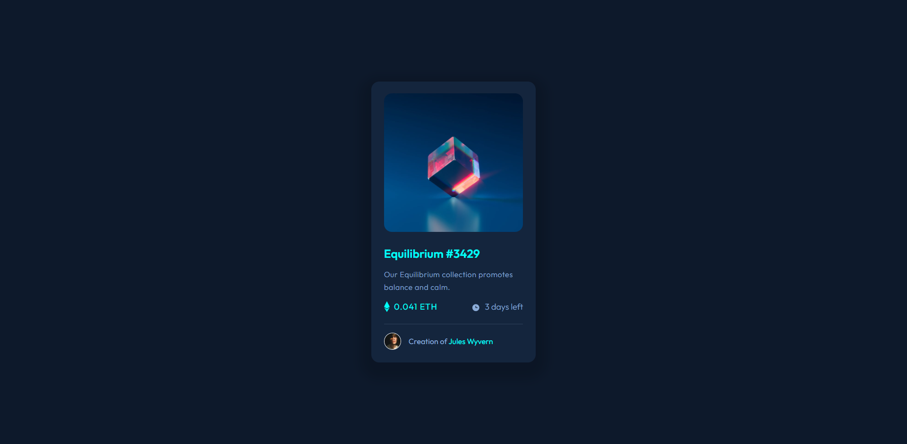
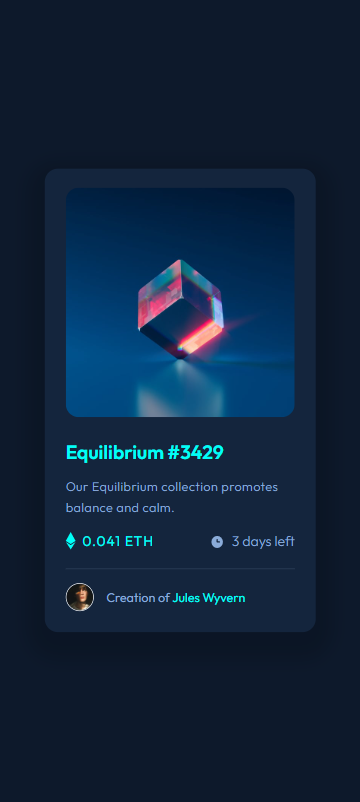

# Frontend Mentor - NFT preview card component solution

This is a solution to the [NFT preview card component challenge on Frontend Mentor](https://www.frontendmentor.io/challenges/nft-preview-card-component-SbdUL_w0U). Frontend Mentor challenges help you improve your coding skills by building realistic projects.

## Table of contents

- [Overview](#overview)
  - [Screenshots](#screenshot)
  - [Links](#links)
- [Author](#author)
- [Acknowledgments](#acknowledgments)

## Overview

Users should be able to:

- View the optimal layout depending on their device's screen size
- See hover states for interactive elements

### Screenshots

### Links

- Solution URL: [Solution](https://your-solution-url.com)
- Live Site URL: [Live site](https://kamilp522.github.io/nft-product-card-component/)

## Author

- Frontend Mentor - [https://www.frontendmentor.io/profile/kamilp522])

## Acknowledgements

Just a simple practice project, I don't have much to add
